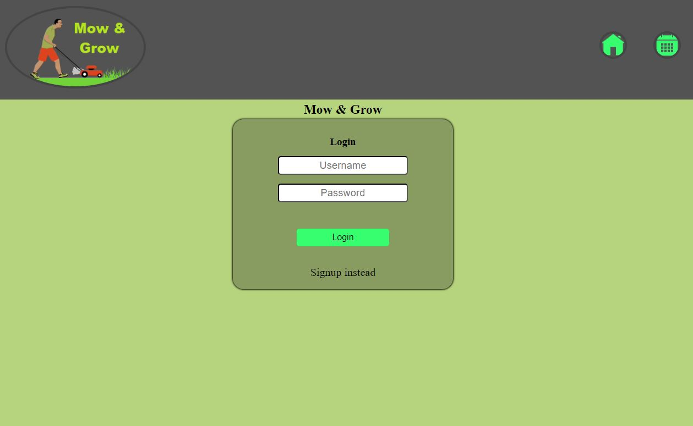
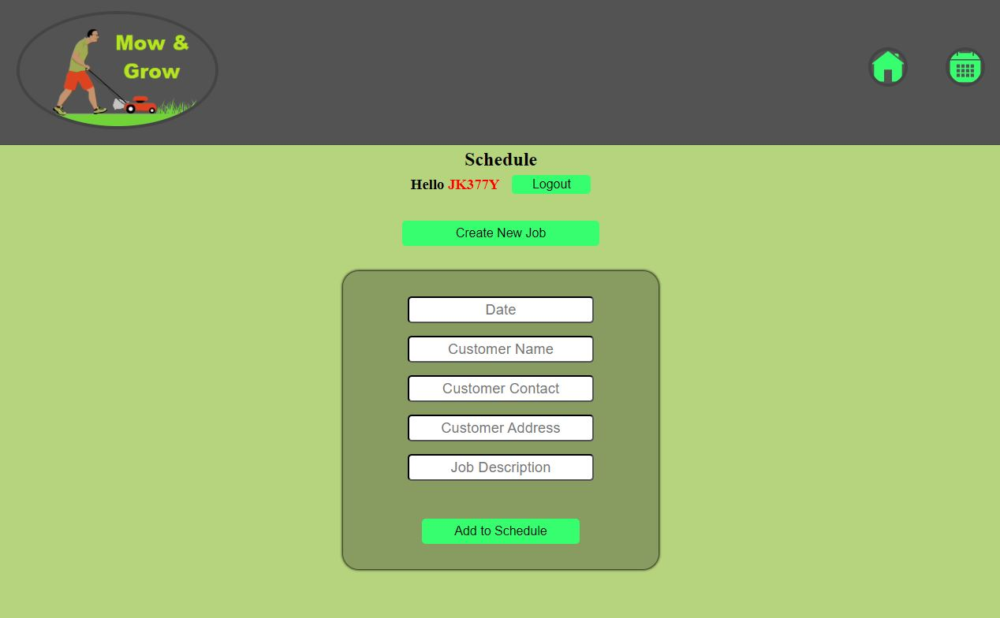

# mow and grow

## ***STILL IN DEVELOPMENT***  &emsp; https://mow-and-grow.vercel.app/
- Current issue is deploying the backend on Vercel. I am currently working on a solution. Mostly issues related to CORS policies. Will resolve soon.

## Table of Contents
- [Description](#description)
- [Technologies Used](#technologies-used)
- [Usage](#usage)
- [Questions](#questions)
- [License](#license)

## Description
This is a web application that I built for my son to schedule his clients for his lawn mower business. Nothing made me more proud than to be able to help him with his own ambitions. It is basically a glorified TODO application but organizes his clients and their appointments chronologically. It also has user authentication with JWT and Bcrypt for security.

## Technologies Used
- MongoDB
- Express
- React
- Node
- Styled Components
- JWT
- Bcrypt

## Usage

 

 

## _Questions_

<h3>Portfolio:&emsp;<a href="https://jk377y.com" target="_blank">https://jk377y.com</a></h3>
<h3>Email:&emsp;<a href="mailto:jk377y@gmail.com" target="_blank">jk377y@gmail.com</a></h3>
<h3>LinkedIn:&emsp;<a href="https://www.linkedin.com/in/james-kelly-software-developer/" target="_blank">https://www.linkedin.com/in/james-kelly-software-developer/</a></h3>
<h3>GitHub:&emsp;<a href="https://github.com/jk377y" target="_blank">https://github.com/jk377y</a></h3>
 

## _License_

 Copyright (c) 2023 James Kelly
 Information on this license can be found at: (https://opensource.org/licenses/MIT)